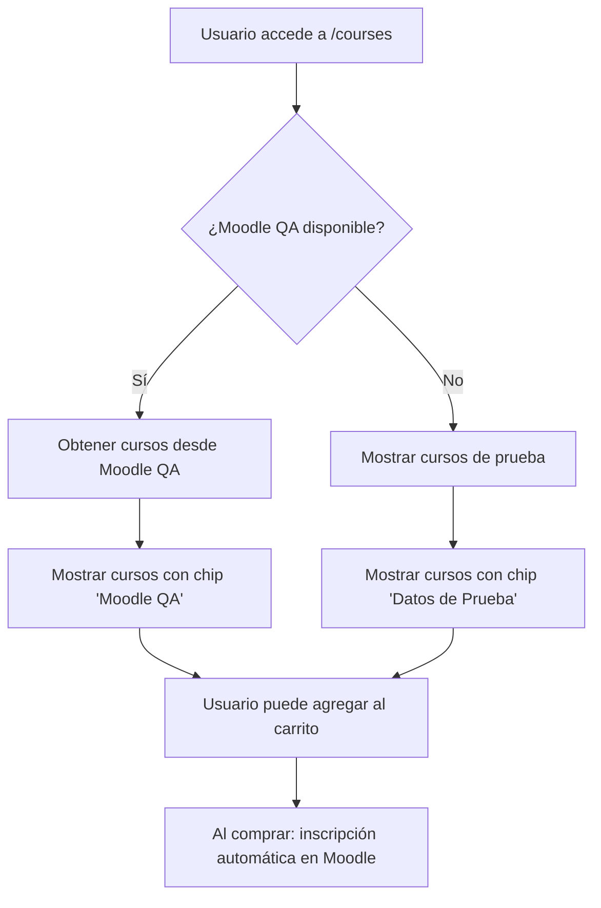

# 🔧 Configuración de Servicios Web en Moodle QA

## 📋 Estado Actual de la Integración

✅ **Frontend completamente integrado** - La aplicación Vue.js está lista para consumir cursos desde Moodle QA
✅ **Fallback implementado** - Si Moodle QA no está disponible, muestra cursos de prueba
✅ **Navbar actualizado** - "Aula Virtual" lleva directamente a https://neekworld.cl/QA/
✅ **Test de integración creado** - Disponible en `/test-moodle.html`

## 🎯 Próximos Pasos para Activar Moodle QA

### 1. Acceder al Panel de Administración de Moodle QA

```
URL: https://neekworld.cl/QA/admin
Usuario: admin
Password: Gala2024.
```

### 2. Habilitar Servicios Web

1. **Ir a:** Administración del sitio → Funciones avanzadas
2. **Habilitar:** "Servicios web" ☑️
3. **Guardar cambios**

### 3. Crear Token de Servicios Web

1. **Ir a:** Administración del sitio → Servidores → Servicios web → Gestionar tokens
2. **Crear nuevo token:**
   - Usuario: admin
   - Servicio: Seleccionar "Default service" o crear uno nuevo
   - IP restringida: (dejar vacío para desarrollo)
3. **Copiar el token generado** 🔑

### 4. Habilitar Funciones de Servicios Web

**Ir a:** Administración del sitio → Servidores → Servicios web → Visión general

**Funciones requeridas para la integración:**
- ✅ `core_webservice_get_site_info` - Información básica del sitio
- ✅ `core_course_get_courses` - Obtener lista de cursos
- ✅ `core_user_create_users` - Crear usuarios automáticamente
- ✅ `core_user_get_users_by_field` - Buscar usuarios
- ✅ `enrol_manual_enrol_users` - Inscribir usuarios en cursos
- ✅ `core_grades_get_grades` - Obtener calificaciones
- ✅ `core_completion_get_course_completion_status` - Estado de finalización

### 5. Configurar Token en la Aplicación

**Opción A: Variable de entorno (recomendado)**
```bash
# En frontend/.env
VUE_APP_MOODLE_TOKEN=tu_token_aqui_generado_en_moodle
```

**Opción B: Directamente en el código (temporal)**
```javascript
// En frontend/src/services/moodleIntegrationService.js
this.config = {
  baseUrl: 'https://neekworld.cl/QA',
  wsEndpoint: '/webservice/rest/server.php',
  token: 'TU_TOKEN_AQUI', // Reemplazar con el token real
  defaultPassword: 'AcademiaTemp2024!'
}
```

## 🧪 Verificar la Integración

### Test Manual
1. **Abrir:** http://localhost:8080/test-moodle.html
2. **Hacer clic en:** "🔗 Probar Conexión"
3. **Hacer clic en:** "📚 Obtener Cursos"

### Test en la Aplicación
1. **Ir a:** http://localhost:8080/courses
2. **Verificar:** Que aparezca el chip "Moodle QA" en verde
3. **Observar:** Los cursos reales de Moodle QA en el catálogo

## 🎓 Crear Cursos de Prueba en Moodle QA

Para tener contenido que mostrar, crear algunos cursos de ejemplo:

1. **Ir a:** Administración del sitio → Cursos → Agregar/editar cursos
2. **Crear cursos de ejemplo:**
   - Python para Data Science
   - Marketing Digital Completo  
   - React Native Masterclass
   - Desarrollo Web con Vue.js 3

## 🔄 Flujo Completo de Integración



## 🛠️ Troubleshooting

### Error: "Token no válido"
- Verificar que el token esté copiado correctamente
- Revisar que los servicios web estén habilitados
- Confirmar que las funciones estén autorizadas

### Error: "CORS"
- Configurar en Moodle: Administración → Seguridad → Políticas HTTP
- Permitir orígenes: `http://localhost:8080`

### No aparecen cursos
- Verificar que los cursos estén marcados como "visibles"
- Confirmar que el usuario admin tenga permisos
- Revisar la función `core_course_get_courses`

## 📱 Estado de Funcionalidades

| Funcionalidad | Estado | Descripción |
|---------------|--------|-------------|
| 🏠 Navbar "Inicio" | ✅ | Lleva a home page |
| 📚 Navbar "Cursos" | ✅ | Catálogo con integración Moodle |
| 🎓 Navbar "Aula Virtual" | ✅ | Abre https://neekworld.cl/QA/ |
| ℹ️ Navbar "Acerca de" | ✅ | Página about |
| 🛒 Carrito de compras | ✅ | Funcional con autenticación |
| 👤 Autenticación | ✅ | Login/Register con Moodle sync |
| 📊 Dashboard | ✅ | Visible para usuarios autenticados |
| 🔄 Sync Moodle | ⚠️ | Requiere token configurado |

## 🎯 Una vez configurado el token:

1. Los cursos del catálogo vendrán directamente de Moodle QA
2. Los usuarios se crearán automáticamente en Moodle al registrarse
3. Las compras se sincronizarán con inscripciones en Moodle
4. El botón "Ir a Moodle" en el navbar dará acceso directo

¿Quieres que acceda al panel de administración de Moodle QA para configurar los servicios web ahora?
